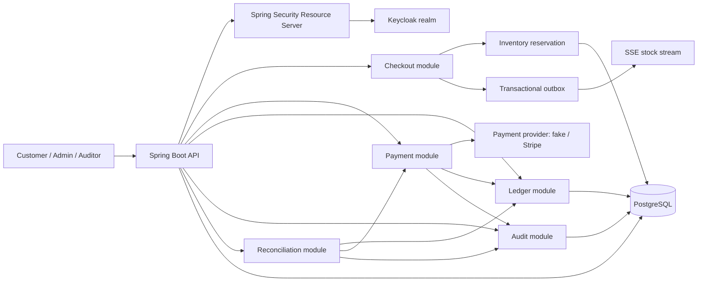

# EcommerceAPI

[](https://github.com/HuuPhu-Nguyen/EcommerceAPI/actions/workflows/ci.yml)

Banking-grade commerce and payments API built with Spring Boot, PostgreSQL, Flyway, OAuth2 resource-server security, idempotent payment workflows, immutable ledger records, tamper-evident audit events, reconciliation checks, and Testcontainers-backed verification.

This is intentionally not a basic CRUD shop. The project uses an e-commerce checkout domain to demonstrate backend judgment that matters in financial systems: preventing duplicate charges, preserving money-movement history, enforcing object-level authorization, detecting audit tampering, and proving transaction behavior with tests.

## Key Technical Highlights

- Java 21 and Spring Boot 3 modular monolith.
- PostgreSQL schema managed by Flyway migrations.
- OAuth2 Resource Server integration with local Keycloak.
- Role and scope authorization for customer, admin, and auditor workflows.
- Subject-based ownership checks for customer carts, orders, payments, refunds, and profile data.
- Atomic inventory reservation during checkout.
- Idempotent payment and refund APIs using scoped keys plus request-body hashing.
- Configurable payment provider boundary with fake local provider and Stripe sandbox adapter.
- Immutable double-entry-style ledger transactions for payment captures and refunds.
- Tamper-evident audit hash chain with verification endpoint.
- Reconciliation report for payments, refunds, ledger transactions, and orphan records.
- Transactional outbox plus Server-Sent Events for advisory stock updates.
- OpenAPI/Swagger documentation with realistic examples.
- CI quality gates for compile, tests, architecture rules, Checkstyle, coverage, Docker build, secret scan, container scan, dependency review, and scheduled OWASP dependency scans.

## Architecture



The code is organized as a pragmatic modular monolith under `com.phu.ecommerceapi`:

- `identity`: current-user resolution, role/scope expressions, OAuth2 integration.
- `customer`: safe customer profile reads and ownership mapping.
- `catalog`: product browsing and admin product management.
- `cart` and `checkout`: customer cart workflow and atomic inventory reservation.
- `order`: order state and lifecycle rules.
- `payment`: idempotency, provider port, payment attempts, refunds, and webhooks.
- `ledger`: immutable accounting-style records for money movement.
- `audit`: audit event persistence and hash-chain verification.
- `outbox` and `inventory`: reliable stock events and SSE broadcasting.
- `reconciliation`: consistency checks across payment, refund, and ledger data.

## Security Model

Authentication uses standard Spring Security OAuth2 Resource Server JWT validation. Local development uses Keycloak from Docker Compose with a preloaded `ecommerce` realm.

The detailed threat model is in [docs/threat-model.md](docs/threat-model.md).

Demo users:

| User | Password | Purpose |
| --- | --- | --- |
| `customer@example.com` | `customer-password` | Customer cart, checkout, payment, refund |
| `admin@example.com` | `admin-password` | Product administration |
| `auditor@example.com` | `auditor-password` | Audit, ledger, reconciliation reads |

Important authorities:

- `ROLE_CUSTOMER` plus scopes such as `cart:write`, `checkout:write`, `payment:create`, and `payment:refund`.
- `ROLE_ADMIN` plus `product:write` for product management.
- `ROLE_AUDITOR` or `ROLE_ADMIN` plus `audit:read` for audit and reconciliation.
- `ROLE_AUDITOR` or `ROLE_ADMIN` plus `ledger:read` for ledger reads.

Ownership checks use the durable OAuth2 subject, not username or email claims.

## Runtime Security Controls

The API includes an application-level in-memory abuse limiter for sensitive local and portfolio deployments:

- `POST /payments`
- `POST /payments/{paymentId}/refunds`
- `POST /payments/provider-webhooks/fake`
- `POST /payments/provider-webhooks/stripe`
- `POST /register`
- `GET /customer/profile/me`

Repeated requests from the same remote address receive a `429 Too Many Requests` Problem Details response with a `Retry-After` header. Provider webhook endpoints also reject oversized bodies before controller logic using `WEBHOOK_MAX_BODY_BYTES`.

For production multi-instance deployments, use Redis-backed rate limiting, an API gateway, or WAF-level throttling with trusted proxy configuration. Keep durable payment/refund idempotency records in PostgreSQL; do not move money-movement idempotency to Redis.

## Payment, Idempotency, And Ledger

Payment creation and refund endpoints require an `Idempotency-Key` header. The key is scoped by customer, endpoint, and operation. The request body is hashed and stored with the first result.

Semantics:

- Same key plus same body returns the original stable response.
- Same key plus different body returns `409 Conflict`.
- Concurrent in-progress duplicates are rejected with a consistent conflict response.
- Provider behavior is deterministic through fake tokens and refund reasons.
- Successful payments post balanced ledger entries.
- Successful refunds post reversing ledger entries.
- Ledger records are append-only; corrections use reversal transactions.

Fake provider examples:

- Payment token `pm_approved`: approved payment.
- Payment token `pm_card_declined`: declined payment.
- Payment token `pm_provider_timeout`: provider timeout path.
- Refund reason `customer_request`: approved refund.
- Refund reason `fake_provider_declined`: declined refund.
- Refund reason `fake_provider_timeout`: provider timeout path.

## Audit And Reconciliation

Sensitive workflows write audit events with actor, action, resource, request id, IP address, user agent, timestamp, previous hash, and event hash. The audit verification endpoint recalculates the hash chain and reports the first broken event if tampering is detected.

The reconciliation report checks:

- Ledger transactions balance.
- Successful payments have capture ledger transactions.
- Successful refunds have reversing ledger transactions.
- Orphaned payments, refunds, or ledger transactions are flagged.

## Local Setup

Prerequisites:

- Java 21 or newer.
- Docker Desktop.
- Git.
- PowerShell examples below assume Windows; the same endpoints work from any HTTP client.

Start infrastructure from a clean demo state:

```powershell
docker compose down -v
docker compose up -d postgres keycloak
```

Run the API in a second terminal:

```powershell
.\mvnw.cmd spring-boot:run "-Dspring-boot.run.profiles=local"
```

Local URLs:

- API: `http://localhost:8080`
- Swagger UI: `http://localhost:8080/swagger-ui.html`
- OpenAPI JSON: `http://localhost:8080/v3/api-docs`
- Keycloak: `http://localhost:8081`
- PostgreSQL: `localhost:5433`

The local profile loads safe demo data from `demo-data.sql`, including one customer profile whose subject matches the imported Keycloak customer and two active products with inventory.

## Production Container

Build the API image from a clean checkout:

```powershell
docker build -t ecommerce-api:local .
```

Run the container with production configuration injected through environment variables or a secret manager. Do not bake secrets into the image or commit real `.env` files.

```powershell
docker run --rm -p 8080:8080 `
    -e SPRING_PROFILES_ACTIVE=prod `
    -e ECOMMERCE_DB_URL="jdbc:postgresql://db.example.internal:5432/ecommerce" `
    -e ECOMMERCE_DB_USERNAME="ecommerce_app" `
    -e ECOMMERCE_DB_PASSWORD="<from-secret-manager>" `
    -e OAUTH2_ISSUER_URI="https://issuer.example.com/realms/ecommerce" `
    -e PAYMENT_PROVIDER_ACTIVE="stripe" `
    -e PAYMENT_PROVIDER_ENABLED="stripe" `
    -e STRIPE_SECRET_KEY="<from-secret-manager>" `
    -e STRIPE_WEBHOOK_SECRET="<from-secret-manager>" `
    -e JAVA_OPTS="-XX:MaxRAMPercentage=75" `
    ecommerce-api:local
```

The Docker image builds the Spring Boot jar with Maven and runs it as a non-root `ecommerce` user. Flyway migrations run on application startup because `spring.flyway.enabled=true`; the production profile uses `spring.jpa.hibernate.ddl-auto=validate`, so schema drift fails fast instead of mutating production tables.

Graceful shutdown is enabled with `server.shutdown=graceful`. Tune `SHUTDOWN_TIMEOUT` for the platform termination window so in-flight requests and lifecycle beans have time to drain.

## Demo Script

Run this in a third PowerShell terminal after the API is up.

```powershell
$base = "http://localhost:8080"
$tokenEndpoint = "http://localhost:8081/realms/ecommerce/protocol/openid-connect/token"

function Get-DemoToken($username, $password) {
    (Invoke-RestMethod `
        -Method Post `
        -Uri $tokenEndpoint `
        -ContentType "application/x-www-form-urlencoded" `
        -Body @{
            client_id = "ecommerce-web"
            grant_type = "password"
            username = $username
            password = $password
        }).access_token
}

$customerToken = Get-DemoToken "customer@example.com" "customer-password"
$auditorToken = Get-DemoToken "auditor@example.com" "auditor-password"

$customerHeaders = @{ Authorization = "Bearer $customerToken" }
$auditorHeaders = @{ Authorization = "Bearer $auditorToken" }

$products = Invoke-RestMethod -Method Get -Uri "$base/products"
$products.content

$cart = Invoke-RestMethod -Method Post -Uri "$base/cart" -Headers $customerHeaders

$cart = Invoke-RestMethod `
    -Method Post `
    -Uri "$base/cart/$($cart.cartId)/items" `
    -Headers $customerHeaders `
    -ContentType "application/json" `
    -Body (@{ productId = 501; quantity = 1 } | ConvertTo-Json)

$order = Invoke-RestMethod `
    -Method Post `
    -Uri "$base/checkout" `
    -Headers $customerHeaders `
    -ContentType "application/json" `
    -Body (@{ cartId = $cart.cartId } | ConvertTo-Json)

$paymentHeaders = @{
    Authorization = "Bearer $customerToken"
    "Idempotency-Key" = "demo-payment-001"
}

$paymentBody = @{
    orderId = $order.orderId
    paymentMethodToken = "pm_approved"
} | ConvertTo-Json

$payment = Invoke-RestMethod `
    -Method Post `
    -Uri "$base/payments" `
    -Headers $paymentHeaders `
    -ContentType "application/json" `
    -Body $paymentBody

$paymentReplay = Invoke-RestMethod `
    -Method Post `
    -Uri "$base/payments" `
    -Headers $paymentHeaders `
    -ContentType "application/json" `
    -Body $paymentBody

$refundHeaders = @{
    Authorization = "Bearer $customerToken"
    "Idempotency-Key" = "demo-refund-001"
}

$refund = Invoke-RestMethod `
    -Method Post `
    -Uri "$base/payments/$($payment.paymentId)/refunds" `
    -Headers $refundHeaders `
    -ContentType "application/json" `
    -Body (@{ reason = "customer_request" } | ConvertTo-Json)

$ledger = Invoke-RestMethod -Method Get -Uri "$base/ledger/transactions?limit=10" -Headers $auditorHeaders
$audit = Invoke-RestMethod -Method Get -Uri "$base/audit/events?limit=10" -Headers $auditorHeaders
$auditVerification = Invoke-RestMethod -Method Get -Uri "$base/audit/events/verification" -Headers $auditorHeaders
$reconciliation = Invoke-RestMethod -Method Get -Uri "$base/reconciliation/report" -Headers $auditorHeaders

$payment
$paymentReplay
$refund
$ledger
$auditVerification
$reconciliation
```

What to look for:

- `$payment.paymentId` and `$paymentReplay.paymentId` match, proving idempotent replay.
- `$ledger` includes payment capture and refund ledger transactions.
- `$auditVerification.verified` is `True`.
- `$reconciliation.healthy` is `True`.

## API Documentation

Swagger UI is the fastest way to inspect and try the API:

```text
http://localhost:8080/swagger-ui.html
```

The OpenAPI document includes examples for checkout, payment, refund, ledger reads, audit events, audit verification, reconciliation, and SSE stock updates.

## Stock Event Stream

Product viewers can subscribe to advisory stock updates with Server-Sent Events:

```http
GET /products/{productId}/stock/stream
Accept: text/event-stream
Authorization: Bearer <access-token>
```

Stock events are written through the transactional outbox and then published to the in-memory SSE broadcaster. The stream is intentionally advisory. Checkout still revalidates and reserves stock atomically in PostgreSQL.

For multiple API instances, keep the outbox table and replace in-memory fan-out with Redis Pub/Sub, Kafka, or another shared event backbone.

## Testing Strategy

Run the same gate CI uses:

```powershell
.\mvnw.cmd verify
```

The suite covers:

- Value object invariants for money, ids, quantity, and email.
- Domain state machines for orders, payments, and refunds.
- Architecture rules with ArchUnit.
- PostgreSQL migrations and repository behavior with Testcontainers.
- Checkout, payment, refund, idempotency, ledger, audit, outbox, and reconciliation flows.
- Security authorization, scopes, and object ownership.
- OpenAPI documentation coverage for key endpoints.

Focused examples:

```powershell
.\mvnw.cmd "-Dtest=ArchitectureTest" test
.\mvnw.cmd "-Dtest=SecurityAuthorizationIntegrationTest" test
.\mvnw.cmd "-Dtest=OpenApiDocumentationTest" test
```

## CI Quality Gates

GitHub Actions runs on pushes and pull requests to `main`.

The main quality gate:

- Compiles with Java 21.
- Runs unit, security, architecture, and Testcontainers-backed integration tests.
- Enforces Checkstyle import/format hygiene.
- Generates and checks JaCoCo coverage.
- Builds the production Docker image.
- Uploads test and coverage reports.

Dependency safety:

- Gitleaks scans repository history for committed secrets.
- Trivy scans the Docker image and uploads SARIF results.
- Pull requests run GitHub dependency review and block high-severity vulnerable dependency changes.
- Dependabot opens weekly Maven and GitHub Actions update PRs.
- A scheduled/manual OWASP Dependency-Check job generates HTML/JSON vulnerability reports and fails on CVSS 7.0 or higher.

Local dependency scan:

```powershell
.\mvnw.cmd -Pdependency-scan -DskipTests "-Djacoco.skip=true" verify
```

The first OWASP scan may take a while while its vulnerability database is bootstrapped.

## Configuration

Safe local defaults are documented in `.env.example`.

Important environment variables:

- Database: `ECOMMERCE_DB_URL`, `ECOMMERCE_DB_USERNAME`, `ECOMMERCE_DB_PASSWORD`
- OAuth2: `OAUTH2_ISSUER_URI`; local profile can also use `OAUTH2_JWK_SET_URI`
- Providers: `PAYMENT_PROVIDER_ACTIVE`, `PAYMENT_PROVIDER_ENABLED`
- Fake provider: `FAKE_PROVIDER_WEBHOOK_SECRET` when `fake` is enabled
- Stripe provider: `STRIPE_SECRET_KEY`, `STRIPE_WEBHOOK_SECRET`, `STRIPE_API_VERSION`, `STRIPE_CONNECT_TIMEOUT_MS`, `STRIPE_READ_TIMEOUT_MS` when `stripe` is enabled
- Payment idempotency recovery: `PAYMENT_IDEMPOTENCY_IN_PROGRESS_LEASE_SECONDS`
- Abuse protection: `RATE_LIMIT_ENABLED`, `RATE_LIMIT_WINDOW_SECONDS`, `RATE_LIMIT_SENSITIVE_REQUESTS_PER_WINDOW`, `RATE_LIMIT_WEBHOOK_REQUESTS_PER_WINDOW`, `RATE_LIMIT_REGISTRATION_REQUESTS_PER_WINDOW`, `RATE_LIMIT_PROFILE_REQUESTS_PER_WINDOW`, `WEBHOOK_MAX_BODY_BYTES`
- Operations: `APP_ENVIRONMENT`, `SHUTDOWN_TIMEOUT`, `LOG_STRUCTURED_FORMAT`, `OUTBOX_PROCESSING_ENABLED`, `RECONCILIATION_SCHEDULING_ENABLED`

No real card data, JWTs, private keys, or production secrets should be committed.

## Current Portfolio Status

The current public story is the banking-grade MVP slice: secure customer checkout, idempotent payments/refunds, immutable ledger entries, tamper-evident audit, reconciliation, threat model, operational observability, OpenAPI docs, and CI proof.

The project is ready for recruiter review. Final readiness evidence is captured in [docs/final-portfolio-review.md](docs/final-portfolio-review.md).
