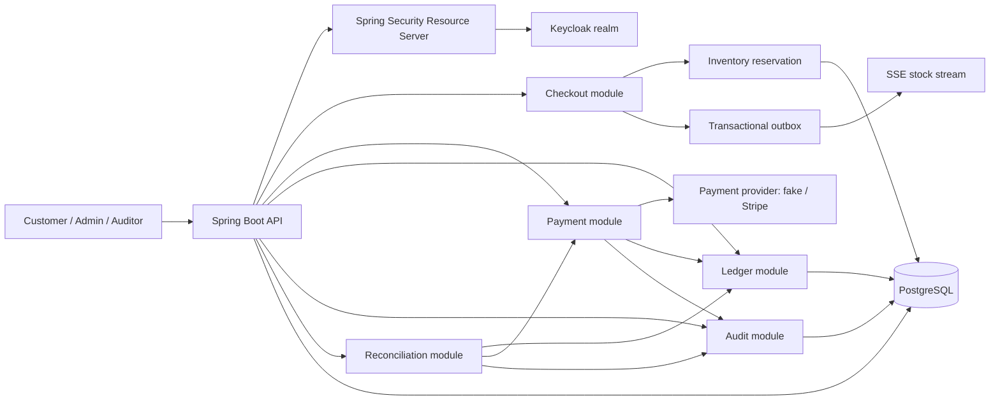

# EcommerceAPI

[](https://github.com/HuuPhu-Nguyen/EcommerceAPI/actions/workflows/ci.yml)

Banking-grade commerce and payments API built with Spring Boot, PostgreSQL, Flyway, OAuth2 resource-server security, idempotent payment workflows, immutable ledger records, tamper-evident audit events, reconciliation checks, and Testcontainers-backed verification.

This is intentionally not a basic CRUD shop. The project uses an e-commerce checkout domain to demonstrate backend judgment that matters in financial systems: preventing duplicate charges, preserving money-movement history, enforcing object-level authorization, detecting audit tampering, and proving transaction behavior with tests.

## Key Technical Highlights

- Java 21 and Spring Boot 3 modular monolith.
- PostgreSQL schema managed by Flyway migrations.
- OAuth2 Resource Server integration with local Keycloak.
- Role and scope authorization for customer, admin, and auditor workflows.
- Subject-based ownership checks for customer carts, orders, payments, refunds, and profile data.
- Atomic inventory reservation during checkout.
- Idempotent payment and refund APIs using scoped keys plus request-body hashing.
- Configurable payment provider boundary with fake local provider and Stripe sandbox adapter.
- Immutable double-entry-style ledger transactions for payment captures and refunds.
- Tamper-evident audit hash chain with verification endpoint.
- Reconciliation report for payments, refunds, ledger transactions, and orphan records.
- Transactional outbox plus Server-Sent Events for advisory stock updates.
- OpenAPI/Swagger documentation with realistic examples.
- CI quality gates for compile, tests, architecture rules, Checkstyle, coverage, Docker build, secret scan, container scan, dependency review, and scheduled OWASP dependency scans.

## Architecture



The code is organized as a pragmatic modular monolith under `com.phu.ecommerceapi`:

- `identity`: current-user resolution, role/scope expressions, OAuth2 integration.
- `customer`: safe customer profile reads and ownership mapping.
- `catalog`: product browsing and admin product management.
- `cart` and `checkout`: customer cart workflow and atomic inventory reservation; checkout revalidates product sellability and cart/item currency, so product deactivation blocks existing carts.
- `order`: order state and lifecycle rules.
- `payment`: idempotency, provider port, payment attempts, refunds, and webhooks.
- `ledger`: immutable accounting-style records for money movement.
- `audit`: audit event persistence and hash-chain verification.
- `outbox` and `inventory`: reliable stock events and SSE broadcasting.
- `reconciliation`: consistency checks across payment, refund, and ledger data.

Relevant ADRs:

- [ADR 0004: Fake Payment Provider First](docs/adr/0004-fake-payment-provider-first.md)
- [ADR 0007: Configurable Payment Providers And Stripe](docs/adr/0007-configurable-payment-providers-and-stripe.md)

## Security Model

Authentication uses standard Spring Security OAuth2 Resource Server JWT validation. Local development uses Keycloak from Docker Compose with a preloaded `ecommerce` realm. Tokens must be issued by the configured issuer, include the configured API audience, and, when configured, come from an allowed authorized party such as the local `ecommerce-web` client.

The detailed threat model is in [docs/threat-model.md](docs/threat-model.md).

Demo users:

| User | Password | Purpose |
| --- | --- | --- |
| `customer@example.com` | `customer-password` | Customer cart, checkout, payment, refund |
| `admin@example.com` | `admin-password` | Product administration |
| `auditor@example.com` | `auditor-password` | Audit, ledger, reconciliation reads |

Important authorities:

- `ROLE_CUSTOMER` plus scopes such as `cart:write`, `checkout:write`, `payment:create`, and `payment:refund`.
- `ROLE_ADMIN` plus `product:write` for product management.
- `ROLE_AUDITOR` or `ROLE_ADMIN` plus `audit:read` for audit and reconciliation.
- `ROLE_AUDITOR` or `ROLE_ADMIN` plus `ledger:read` for ledger reads.

Realm roles remain accepted intentionally so the local Keycloak realm can express user roles once at the realm level. Client roles are trusted only from the configured API resource client, `ecommerce-api` by default; roles under any other `resource_access` client are ignored.

Ownership checks use the durable OAuth2 subject, not username or email claims.
Customer profiles are created or returned by signing in through Keycloak and calling `POST /customer/profile/me`; the API does not accept anonymous password registration.
Admin and auditor profile review uses `GET /admin/customer-profiles?page=0&size=50`; `size` is capped at 100 and the response includes `items`, `page`, `size`, `totalElements`, and `totalPages`.

## Runtime Security Controls

The API includes an application-level in-memory abuse limiter for sensitive local and portfolio deployments:

- `POST /payments`
- `POST /payments/{paymentId}/refunds`
- `POST /payments/provider-webhooks/fake`
- `POST /payments/provider-webhooks/stripe`
- `POST /customer/profile/me`
- `GET /customer/profile/me`

Repeated requests from the same remote address receive a `429 Too Many Requests` Problem Details response with a `Retry-After` header. Provider webhook endpoints also reject oversized bodies before controller logic using `WEBHOOK_MAX_BODY_BYTES`, even when `Content-Length` is missing or false. Production ingress or reverse proxy body-size limits are still required and should be set to the same or a lower value than `WEBHOOK_MAX_BODY_BYTES`.

Every HTTP request receives an internally generated `X-Request-Id`; caller-provided `X-Request-Id` values are validated and stored only as `externalCorrelationId` for correlation. `X-Forwarded-For` is ignored unless the immediate remote address matches a CIDR in `TRUSTED_PROXY_CIDRS`; production deployments behind a reverse proxy must configure that list or rely on a platform layer that overwrites forwarding headers.

OpenAPI and Swagger UI are public in local/test by default for development. Production disables SpringDoc by default with `SPRINGDOC_API_DOCS_ENABLED=false` and `SPRINGDOC_SWAGGER_UI_ENABLED=false`. To expose authenticated production docs, set both SpringDoc flags to `true` and keep `OPENAPI_PUBLIC_DOCS_ENABLED=false`; only admin or auditor users can access docs. Setting `OPENAPI_PUBLIC_DOCS_ENABLED=true` intentionally makes docs public.

For production multi-instance deployments, use Redis-backed rate limiting, an API gateway, or WAF-level throttling with trusted proxy configuration. Keep durable payment/refund idempotency records in PostgreSQL; do not move money-movement idempotency to Redis.

## Payment, Idempotency, And Ledger

Payment creation and refund endpoints require an `Idempotency-Key` header. The key is scoped by customer, endpoint, and operation. The request body is hashed and stored with the first result.

Semantics:

- Same key plus same body returns the original stable response.
- Same key plus different body returns `409 Conflict`.
- Concurrent in-progress duplicates are rejected with a consistent conflict response.
- Database uniqueness or optimistic race conflicts return a sanitized `409 Conflict` Problem Details response.
- Transient database lock, deadlock, or query-timeout failures return a sanitized `503 Service Unavailable` Problem Details response and should be retried by the client.
- Provider behavior is deterministic through fake tokens and refund reasons.
- Successful payments post balanced ledger entries.
- Successful refunds post reversing ledger entries.
- Successful provider outcomes are persisted before ledger and audit side effects as `PROVIDER_SUCCEEDED_LEDGER_PENDING`.
- If ledger posting or audit recording fails after provider success, recovery retries local completion without calling the provider again.
- Ledger records are append-only; corrections use reversal transactions.

Fake provider examples:

- Payment token `pm_approved`: approved payment.
- Payment token `pm_card_declined`: declined payment.
- Payment token `pm_provider_timeout`: provider timeout path.
- Refund reason `customer_request`: approved refund.
- Refund reason `fake_provider_declined`: declined refund.
- Refund reason `fake_provider_timeout`: provider timeout path.

## Audit And Reconciliation

Sensitive workflows write audit events with actor, action, resource, internal request id, validated external correlation id, IP address, user agent, timestamp, previous hash, and event hash. The audit verification endpoint recalculates the hash chain in bounded pages and reports the first broken event if tampering is detected. Verification can still take time on very large chains, but it does not load every audit event into one in-memory list.

The reconciliation report checks:

- Ledger transactions balance.
- Successful payments have capture ledger transactions.
- Successful refunds have reversing ledger transactions.
- Provider-success rows still stuck in `PROVIDER_SUCCEEDED_LEDGER_PENDING` after the recovery pass are flagged for operator review.
- Orphaned payments, refunds, or ledger transactions are flagged.

Reconciliation runs are materialized. `POST /reconciliation/runs` starts a bounded run for local/demo use, paging through records with `RECONCILIATION_BATCH_SIZE` and storing at most the first `RECONCILIATION_MAX_ISSUES_PER_RUN` issue rows while preserving the full issue count. `GET /reconciliation/report` reads the latest completed run and does not run reconciliation synchronously.

## Local Setup

Prerequisites:

- Java 21 or newer.
- Docker Desktop.
- Git.
- PowerShell examples below assume Windows; the same endpoints work from any HTTP client.

Start infrastructure from a clean demo state:

```powershell
docker compose down -v
docker compose up -d postgres keycloak
```

Run the API in a second terminal:

```powershell
.\mvnw.cmd spring-boot:run "-Dspring-boot.run.profiles=local"
```

Local URLs:

- API: `http://localhost:8080`
- Swagger UI: `http://localhost:8080/swagger-ui.html`
- OpenAPI JSON: `http://localhost:8080/v3/api-docs`
- Keycloak: `http://localhost:8081`
- PostgreSQL: `localhost:5433`

The local profile loads safe demo data from `demo-data.sql`, including one customer profile whose subject matches the imported Keycloak customer and two active products with inventory.

## Payment Provider Setup

The default local setup is fake-only and does not require Stripe secrets:

```powershell
$env:PAYMENT_PROVIDER_ACTIVE = "fake"
$env:PAYMENT_PROVIDER_ENABLED = "fake"
.\mvnw.cmd spring-boot:run "-Dspring-boot.run.profiles=local"
```

Use this mode for the main demo, local development, and CI. The fake provider supports USD and EUR, is deterministic, supports success/failure/timeout paths, and keeps tests independent from external accounts.

To review Stripe sandbox behavior, enable both providers and keep `fake` as the active default:

```powershell
$env:PAYMENT_PROVIDER_ACTIVE = "fake"
$env:PAYMENT_PROVIDER_ENABLED = "fake,stripe"
$env:STRIPE_SECRET_KEY = "sk_test_replace_me"
$env:STRIPE_WEBHOOK_SECRET = "whsec_replace_me"
$env:STRIPE_CONNECT_TIMEOUT_MS = "2000"
$env:STRIPE_READ_TIMEOUT_MS = "5000"
.\mvnw.cmd spring-boot:run "-Dspring-boot.run.profiles=local"
```

When more than one provider is enabled, payment requests should include `"provider": "fake"` or `"provider": "stripe"`. Refunds do not choose a provider; they route through the provider that captured the original payment.

Stripe webhook local testing can be done with the Stripe CLI:

```powershell
stripe login
stripe listen --forward-to localhost:8080/payments/provider-webhooks/stripe
```

Copy the `whsec_...` value printed by `stripe listen` into `STRIPE_WEBHOOK_SECRET` before starting the API. Then create a Stripe sandbox payment through the API so Stripe sends the matching provider event with the app metadata. Synthetic `stripe trigger ...` events are still useful for checking signature delivery, but events without this app's metadata may be stored as rejected or reconciliation-required.

CI and automated tests use fake providers, mocks, stubs, and Testcontainers. They do not require real Stripe API keys or webhook secrets.

## Production Container

Build the API image from a clean checkout:

```powershell
docker build -t ecommerce-api:local .
```

Run the container with production configuration injected through environment variables or a secret manager. Do not bake secrets into the image or commit real `.env` files.

```powershell
docker run --rm -p 8080:8080 `
    -e SPRING_PROFILES_ACTIVE=prod `
    -e ECOMMERCE_DB_URL="jdbc:postgresql://db.example.internal:5432/ecommerce" `
    -e ECOMMERCE_DB_USERNAME="ecommerce_app" `
    -e ECOMMERCE_DB_PASSWORD="<from-secret-manager>" `
    -e OAUTH2_ISSUER_URI="https://issuer.example.com/realms/ecommerce" `
    -e OAUTH2_REQUIRED_AUDIENCE="ecommerce-api" `
    -e OAUTH2_RESOURCE_CLIENT_ID="ecommerce-api" `
    -e OAUTH2_ALLOWED_AUTHORIZED_PARTIES="ecommerce-web" `
    -e PAYMENT_PROVIDER_ACTIVE="stripe" `
    -e PAYMENT_PROVIDER_ENABLED="stripe" `
    -e STRIPE_SECRET_KEY="<from-secret-manager>" `
    -e STRIPE_WEBHOOK_SECRET="<from-secret-manager>" `
    -e JAVA_OPTS="-XX:MaxRAMPercentage=75" `
    ecommerce-api:local
```

The Docker image builds the Spring Boot jar with Maven and runs it as a non-root `ecommerce` user. Flyway migrations run on application startup because `spring.flyway.enabled=true`; the production profile uses `spring.jpa.hibernate.ddl-auto=validate`, so schema drift fails fast instead of mutating production tables.

Graceful shutdown is enabled with `server.shutdown=graceful`. Tune `SHUTDOWN_TIMEOUT` for the platform termination window so in-flight requests and lifecycle beans have time to drain.

## Demo Script

Run this in a third PowerShell terminal after the API is up.

```powershell
$base = "http://localhost:8080"
$tokenEndpoint = "http://localhost:8081/realms/ecommerce/protocol/openid-connect/token"

function Get-DemoToken($username, $password) {
    (Invoke-RestMethod `
        -Method Post `
        -Uri $tokenEndpoint `
        -ContentType "application/x-www-form-urlencoded" `
        -Body @{
            client_id = "ecommerce-web"
            grant_type = "password"
            username = $username
            password = $password
        }).access_token
}

$customerToken = Get-DemoToken "customer@example.com" "customer-password"
$auditorToken = Get-DemoToken "auditor@example.com" "auditor-password"

$customerHeaders = @{ Authorization = "Bearer $customerToken" }
$auditorHeaders = @{ Authorization = "Bearer $auditorToken" }

$profile = Invoke-RestMethod -Method Post -Uri "$base/customer/profile/me" -Headers $customerHeaders
$profile

$products = Invoke-RestMethod -Method Get -Uri "$base/products"
$products.content

$cart = Invoke-RestMethod -Method Post -Uri "$base/cart" -Headers $customerHeaders

$cart = Invoke-RestMethod `
    -Method Post `
    -Uri "$base/cart/$($cart.cartId)/items" `
    -Headers $customerHeaders `
    -ContentType "application/json" `
    -Body (@{ productId = 501; quantity = 1 } | ConvertTo-Json)

$order = Invoke-RestMethod `
    -Method Post `
    -Uri "$base/checkout" `
    -Headers $customerHeaders `
    -ContentType "application/json" `
    -Body (@{ cartId = $cart.cartId } | ConvertTo-Json)

$paymentHeaders = @{
    Authorization = "Bearer $customerToken"
    "Idempotency-Key" = "demo-payment-001"
}

$paymentBody = @{
    orderId = $order.orderId
    provider = "fake"
    paymentMethodToken = "pm_approved"
} | ConvertTo-Json

$payment = Invoke-RestMethod `
    -Method Post `
    -Uri "$base/payments" `
    -Headers $paymentHeaders `
    -ContentType "application/json" `
    -Body $paymentBody

$paymentReplay = Invoke-RestMethod `
    -Method Post `
    -Uri "$base/payments" `
    -Headers $paymentHeaders `
    -ContentType "application/json" `
    -Body $paymentBody

$refundHeaders = @{
    Authorization = "Bearer $customerToken"
    "Idempotency-Key" = "demo-refund-001"
}

$refund = Invoke-RestMethod `
    -Method Post `
    -Uri "$base/payments/$($payment.paymentId)/refunds" `
    -Headers $refundHeaders `
    -ContentType "application/json" `
    -Body (@{ reason = "customer_request" } | ConvertTo-Json)

$ledger = Invoke-RestMethod -Method Get -Uri "$base/ledger/transactions?limit=10" -Headers $auditorHeaders
$audit = Invoke-RestMethod -Method Get -Uri "$base/audit/events?limit=10" -Headers $auditorHeaders
$auditVerification = Invoke-RestMethod -Method Get -Uri "$base/audit/events/verification" -Headers $auditorHeaders
$reconciliation = Invoke-RestMethod -Method Post -Uri "$base/reconciliation/runs" -Headers $auditorHeaders

$payment
$paymentReplay
$refund
$ledger
$auditVerification
$reconciliation
```

What to look for:

- `$payment.paymentId` and `$paymentReplay.paymentId` match, proving idempotent replay.
- `$payment.provider` and `$refund.provider` are `fake`, proving provider identity is carried in responses.
- `$ledger` includes payment capture and refund ledger transactions.
- `$auditVerification.verified` is `True`.
- `$reconciliation.healthy` is `True`.

## Optional Stripe Sandbox Smoke Test

Run this only after configuring `PAYMENT_PROVIDER_ACTIVE=fake`, `PAYMENT_PROVIDER_ENABLED=fake,stripe`, and Stripe sandbox secrets as shown above.

1. Start PostgreSQL and Keycloak with `docker compose up -d postgres keycloak`.
2. Start `stripe listen --forward-to localhost:8080/payments/provider-webhooks/stripe` and copy its `whsec_...` value into `STRIPE_WEBHOOK_SECRET`.
3. Start the API with the local profile and the fake-plus-Stripe provider environment.
4. Authenticate as `customer@example.com`.
5. Create a cart, add a product, and checkout.
6. Confirm the checkout response contains both `fake` and `stripe` in `allowedPaymentProviders`.
7. Create a payment with an explicit Stripe provider:

```powershell
$stripePaymentHeaders = @{
    Authorization = "Bearer $customerToken"
    "Idempotency-Key" = "stripe-payment-smoke-001"
}

$stripePaymentBody = @{
    orderId = $order.orderId
    provider = "stripe"
    paymentMethodToken = "pm_card_visa"
} | ConvertTo-Json

$stripePayment = Invoke-RestMethod `
    -Method Post `
    -Uri "$base/payments" `
    -Headers $stripePaymentHeaders `
    -ContentType "application/json" `
    -Body $stripePaymentBody

$stripePayment.provider
$stripePayment.providerPaymentId
```

8. Verify the payment response has `provider` set to `stripe` and a Stripe `providerPaymentId` such as `pi_...`.
9. Let the Stripe CLI forward the provider webhook, or replay the matching event from the Stripe dashboard/CLI.
10. Verify the order state, ledger entries, audit event, provider webhook event, and reconciliation report.
11. Create a refund for the Stripe payment. The refund request body still contains only the reason; the response should contain `provider` set to `stripe` and a Stripe refund id such as `re_...`.
12. Verify reversing ledger entries, audit, provider webhook replay safety, and a healthy reconciliation report.

## API Documentation

Swagger UI is the fastest way to inspect and try the API:

```text
http://localhost:8080/swagger-ui.html
```

The OpenAPI document includes examples for checkout with `allowedPaymentProviders`, provider-selected payment creation, provider-coded payment/refund responses, Stripe provider webhooks, ledger reads, audit events, audit verification, reconciliation, and SSE stock updates. The Stripe webhook path is documented as a provider callback, not a customer API.

## Stock Event Stream

Product viewers can subscribe to advisory stock updates with Server-Sent Events:

```http
GET /products/{productId}/stock/stream
Accept: text/event-stream
Authorization: Bearer <access-token>
```

Stock events are written through the transactional outbox and then published to the in-memory SSE broadcaster. The processor claims due rows in one transaction, commits that claim, publishes outside the database transaction, and then marks the outbox row processed or failed in a second transaction. Abandoned `PROCESSING` rows time out and retry. Delivery is at least once, so any future non-advisory publisher must use the outbox event id as an idempotency key for external side effects.

The stream is intentionally advisory. Checkout still revalidates and reserves stock atomically in PostgreSQL.

For multiple API instances, keep the outbox table and replace in-memory fan-out with Redis Pub/Sub, Kafka, or another shared event backbone.

## Testing Strategy

Run the same gate CI uses:

```powershell
.\mvnw.cmd verify
```

The suite covers:

- Value object invariants for money, ids, quantity, and email.
- Domain state machines for orders, payments, and refunds.
- Architecture rules with ArchUnit.
- PostgreSQL migrations and repository behavior with Testcontainers.
- Checkout, payment, refund, idempotency, ledger, audit, outbox, and reconciliation flows.
- Security authorization, scopes, and object ownership.
- OpenAPI documentation coverage for key endpoints.

Focused examples:

```powershell
.\mvnw.cmd "-Dtest=ArchitectureTest" test
.\mvnw.cmd "-Dtest=SecurityAuthorizationIntegrationTest" test
.\mvnw.cmd "-Dtest=OpenApiDocumentationTest" test
```

## Final Phase 8 Verification

Full local verification for the Stripe/multi-provider phase:

```powershell
.\mvnw.cmd -B -ntp verify
.\mvnw.cmd -B -ntp -Pdependency-scan -DskipTests "-Djacoco.skip=true" verify
docker build -t ecommerce-api:local .
gitleaks detect --source . --redact
trivy image ecommerce-api:local
```

The dependency scan needs a bootstrapped OWASP vulnerability database. The `gitleaks` and `trivy` commands require those CLIs locally; CI runs equivalent maintained GitHub Actions.

Race-safety checklist covered by Phase 8 tests and the final review:

- Concurrent payment attempts for one order result in one provider call.
- Concurrent payment attempts with different providers for one order result in one provider call.
- Stripe timeout does not allow a second attempt until reconciliation resolves the outcome.
- Stripe async pending results do not post ledger entries until success.
- Durable provider success is recovered locally after ledger/audit interruption without another provider side-effect call.
- Stripe webhook duplicate, concurrent, and out-of-order delivery does not duplicate ledger entries or corrupt order state.
- Stripe refund duplicate, concurrent, timeout, and webhook replay cases do not duplicate provider refunds or reversing ledger entries.
- Stuck Stripe `IN_PROGRESS` idempotency records are recovered to a stable response or flagged for manual review without a new provider side-effect call.

## CI Quality Gates

GitHub Actions runs on pushes and pull requests to `main`.

The main quality gate:

- Compiles with Java 21.
- Runs unit, security, architecture, and Testcontainers-backed integration tests.
- Enforces Checkstyle import/format hygiene.
- Generates and checks JaCoCo coverage.
- Builds the production Docker image.
- Uploads test and coverage reports.

Dependency safety:

- Gitleaks scans repository history for committed secrets.
- Trivy scans the Docker image and uploads SARIF results.
- Pull requests run GitHub dependency review and block high-severity vulnerable dependency changes.
- Dependabot opens weekly Maven and GitHub Actions update PRs.
- A scheduled/manual OWASP Dependency-Check job generates HTML/JSON vulnerability reports and fails on CVSS 7.0 or higher.

Local dependency scan:

```powershell
.\mvnw.cmd -Pdependency-scan -DskipTests "-Djacoco.skip=true" verify
```

The first OWASP scan may take a while while its vulnerability database is bootstrapped.

## Configuration

Safe local defaults are documented in `.env.example`.

Important environment variables:

- Database: `ECOMMERCE_DB_URL`, `ECOMMERCE_DB_USERNAME`, `ECOMMERCE_DB_PASSWORD`
- OAuth2: `OAUTH2_ISSUER_URI`, `OAUTH2_REQUIRED_AUDIENCE`, `OAUTH2_RESOURCE_CLIENT_ID`, `OAUTH2_ALLOWED_AUTHORIZED_PARTIES`; local profile can also use `OAUTH2_JWK_SET_URI`
- Providers: `PAYMENT_PROVIDER_ACTIVE`, `PAYMENT_PROVIDER_ENABLED`
- Fake provider: `FAKE_PROVIDER_WEBHOOK_SECRET` when `fake` is enabled
- Stripe provider: `STRIPE_SECRET_KEY`, `STRIPE_WEBHOOK_SECRET`, `STRIPE_API_VERSION`, `STRIPE_CONNECT_TIMEOUT_MS`, `STRIPE_READ_TIMEOUT_MS` when `stripe` is enabled
- Payment idempotency recovery: `PAYMENT_IDEMPOTENCY_IN_PROGRESS_LEASE_SECONDS`
- Abuse protection: `RATE_LIMIT_ENABLED`, `RATE_LIMIT_WINDOW_SECONDS`, `RATE_LIMIT_SENSITIVE_REQUESTS_PER_WINDOW`, `RATE_LIMIT_WEBHOOK_REQUESTS_PER_WINDOW`, `RATE_LIMIT_PROFILE_REQUESTS_PER_WINDOW`, `WEBHOOK_MAX_BODY_BYTES`
- Operations: `APP_ENVIRONMENT`, `SHUTDOWN_TIMEOUT`, `LOG_STRUCTURED_FORMAT`, `OUTBOX_PROCESSING_ENABLED`, `AUDIT_HASH_VERIFICATION_BATCH_SIZE`, `RECONCILIATION_SCHEDULING_ENABLED`, `RECONCILIATION_BATCH_SIZE`, `RECONCILIATION_MAX_ISSUES_PER_RUN`

No real card data, JWTs, private keys, or production secrets should be committed.

## Current Portfolio Status

The current public story is the banking-grade MVP slice: secure customer checkout, idempotent payments/refunds, immutable ledger entries, tamper-evident audit, reconciliation, threat model, operational observability, OpenAPI docs, and CI proof.

The project is ready for recruiter review. Final readiness evidence is captured in [docs/final-portfolio-review.md](docs/final-portfolio-review.md).
